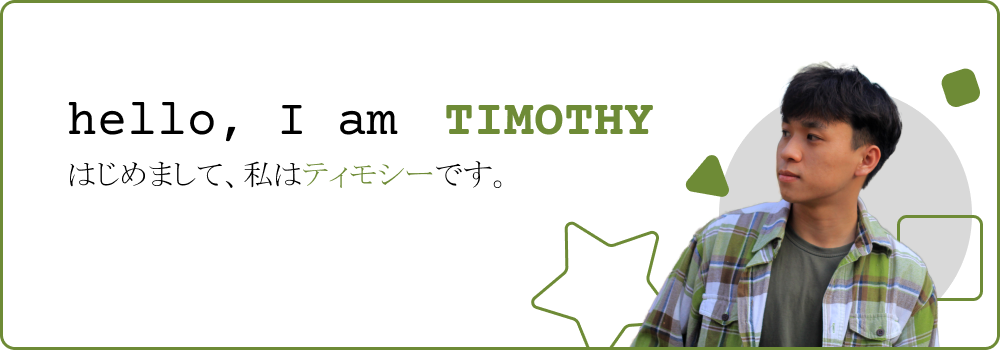

 
   
   
  

  
<h2>👨🏽‍💻 ABOUT ME :</h2>

  
  

- 🎓 I’m currently learning Software Engineering at: [Ho Chi Minh city University of Technology and Education](https://hcmute.edu.vn) (HCMUTE).
- 💻 I’m studying Web Development. 
- 🎼USUK_muzic | 🍏minimalism | 📖love_reading | ☕hot_latte
- 📖 I'm learning two foreign languages: English, 日本語
- 💬 Ask me about: <b>Anything, honestly, I love knowledge and learning new things.
 
  
<h2>📬 MY CONTACTS</h2>

  
    
  
   

 
  
<h2>📬 SKILLS</h2>
<h3>🎯 Languages:</h3>

  
  
  
  
  
  

  
<h3>🎯 Frameworks/Libraries:</h3>
  

    
    
    
    
    
    
  

  
<h3>🎯 Databases:</h3>
  

    
    
    

  
<h3>🎯 Tools:</h3>
  

    
    
    
    
    
    
    
    
  

 

<h2>📌 MY GITHUB'S STATS</h2>
  

        
  

  

